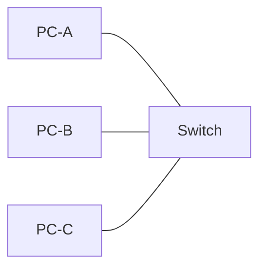
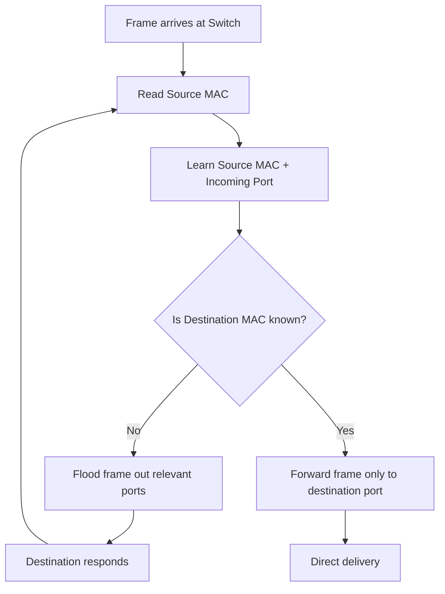
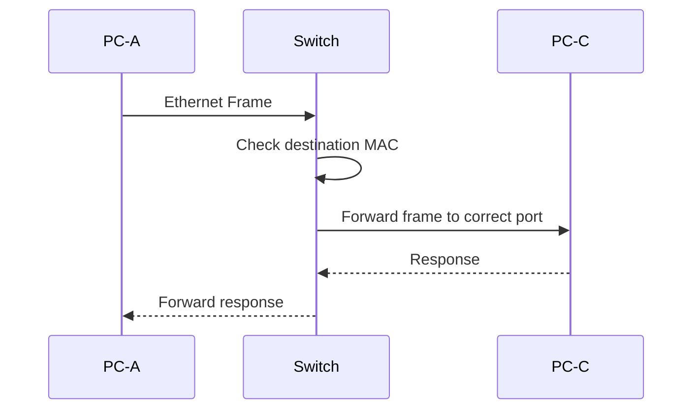

Peer-to-Peer Network

A simple Cisco Packet Tracer implementation of a **Peer-to-Peer (P2P) network**, where computers communicate directly with each other and each computer can act as both a client and a resource provider.

In a peer-to-peer network, there is **no dedicated central server** controlling the communication between the computers. Each connected computer can share resources such as files, folders, or services with other computers.

The peers can communicate either through a **direct connection** or through a networking device such as a switch.

```text
PC-A  <──────────────>  PC-B
        Direct P2P
```

## Two Ways to Establish P2P Communication

### 1. Direct PC-to-PC Connection

Two computers can be connected directly using an Ethernet cable.

For traditional Ethernet connections between similar devices such as:

```text
PC  ↔  PC
```

a **crossover cable** is used because the transmit and receive pairs need to be crossed between the two devices.

```text
PC-A ───── Crossover Cable ───── PC-B
```

### 2. P2P Network Through a Switch/HUB

Multiple computers can communicate as peers through a switch.



In this setup, the switch does **not become a server**. It only provides the forwarding path between the peer computers.

For connections between different device types, such as:

```text
PC ↔ Switch
```

a **straight-through cable** is traditionally used.

## How the Switch Learns MAC Addresses

The switch uses a **MAC address table (CAM table)** to determine where Ethernet frames should be forwarded.

When a frame enters the switch, the switch first examines the **source MAC address** and associates it with the port on which the frame arrived.

For example:

```text
MAC Address        Port
------------------------
AA:AA:AA:AA:AA:01  Fa0/1
BB:BB:BB:BB:BB:02  Fa0/2
CC:CC:CC:CC:CC:03  Fa0/3
```

The learning process works progressively:



Initially, the switch may **flood an unknown unicast frame** because it does not yet know which port contains the destination device. As devices communicate, the switch learns their source MAC addresses and builds its MAC address table.

Once the destination MAC address is known, the switch can forward the frame specifically to the correct port instead of flooding it to other ports.

> **Note:** Broadcast traffic is also flooded by a switch within the applicable VLAN. Multicast traffic can be handled differently depending on the switch configuration; it is not simply a fixed "broadcast → multicast → unicast" learning sequence.

## Communication Flow

For example, when **PC-A sends data to PC-C**:



The switch therefore acts as a **Layer 2 forwarding device**, while the computers remain the peers communicating with each other.

## Key Concepts Demonstrated

* Peer-to-peer communication
* Direct PC-to-PC Ethernet connection
* Crossover cable
* PC-to-switch connection using straight-through cable
* Ethernet frames
* MAC addresses
* MAC address learning
* CAM/MAC address table
* Unknown-unicast flooding
* Unicast forwarding
* Switch-based peer-to-peer communication

## Packet Tracer File

The `.pkt` file included in this directory contains the complete Cisco Packet Tracer implementation of the network.
